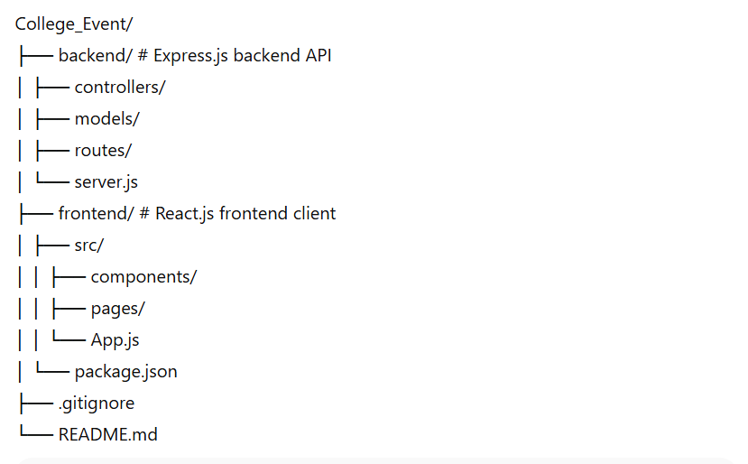
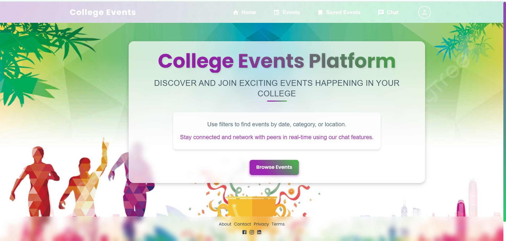
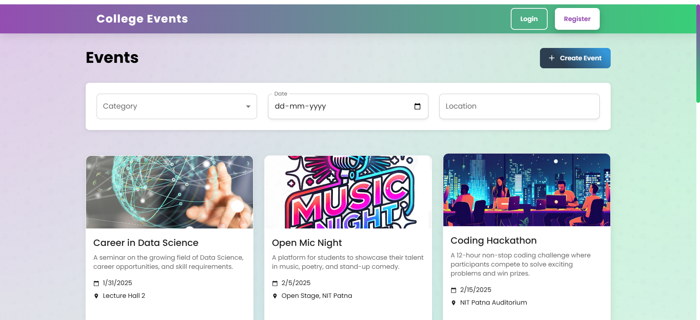

# 🎉 College Event Networking Platform

A **full-stack MERN platform** for discovering, managing, and networking during college events. This platform enables students to explore events, register easily, chat in real-time with other attendees, and allows organizers and admins to manage events efficiently.

---

## 🚀 Tech Stack
- **Frontend:** React.js, Material UI, React Router  
- **Backend:** Node.js, Express.js  
- **Database:** MongoDB (Atlas)  
- **Real-Time Communication:** Socket.IO  
- **Authentication & Security:** JWT, bcrypt  
- **Deployment:** Netlify (Frontend), Render (Backend)

---

## ✨ Features

### Core Features
- 🔑 **Role-Based Authentication:** Student, Organizer, and Admin accounts with proper privileges  
- 📅 **Event Creation & Registration:** Easy management and registration for college events  
- 🔍 **Event Filtering & Search:** Filter events by date, category, location, and popularity  
- 💬 **Real-Time Chat:** Communicate instantly with other attendees  
- 📊 **Admin Dashboard:** Monitor events, users, and platform analytics  

### Additional Features
- 🔔 Notifications for upcoming events  
- 📱 Fully responsive and mobile-friendly design  
- 👤 User profiles with event history  
- 🔒 Secure password hashing and JWT-based sessions  

---

## 📂 Project Structure

## ⚙️ Setup Instructions

### Backend
```bash
cd backend
npm install
npm run dev

# Frontend
cd frontend
npm install
npm start

🌐 Live Demo
Project Live Link : http://clgevent.netlify.app/
Frontend Depolyed : Netlify
Backend Depolyed : Render
---
## 📸 Screenshots
**Homepage**  

**Event Listing & Filter**  

---
💡 How It Works

-Users sign up and log in according to their roles.

-Organizers can create and manage events.

-Students browse, filter, and register for events.

-Real-time chat connects attendees during events.

-Admins monitor platform activity and manage users/events.

🔒 Security

-Passwords hashed using bcrypt

-JWT authentication for secure routes

-Role-based access control to prevent unauthorized access

📈 Future Enhancements

-Event calendar view with drag-and-drop registration

-AI-based event recommendations

-Virtual event video streaming

-Advanced analytics and reporting for admins
